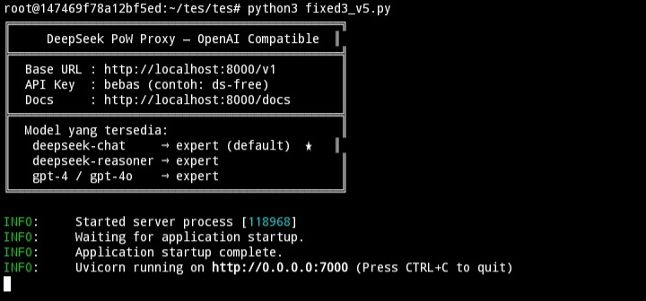
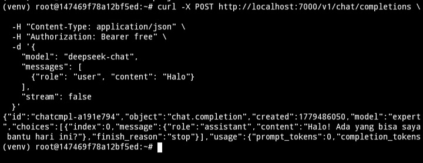

<div align="center">

```
██████╗ ███████╗███████╗██████╗ ███████╗███████╗███████╗██╗  ██╗
██╔══██╗██╔════╝██╔════╝██╔══██╗██╔════╝██╔════╝██╔════╝██║ ██╔╝
██║  ██║█████╗  █████╗  ██████╔╝███████╗█████╗  █████╗  █████╔╝ 
██║  ██║██╔══╝  ██╔══╝  ██╔═══╝ ╚════██║██╔══╝  ██╔══╝  ██╔═██╗ 
██████╔╝███████╗███████╗██║     ███████║███████╗███████╗██║  ██╗
╚═════╝ ╚══════╝╚══════╝╚═╝     ╚══════╝╚══════╝╚══════╝╚═╝  ╚═╝
                      PoW Proxy — OpenAI Compatible
```

[](https://python.org)
[](https://fastapi.tiangolo.com)
[](LICENSE)
[]()

> **🚀 Jalankan DeepSeek AI secara lokal dengan antarmuka OpenAI-compatible.**  
> Satu proxy, semua app yang support OpenAI langsung bisa pakai DeepSeek.

</div>

---

## ✨ Fitur Utama

| Fitur | Keterangan |
|-------|-----------|
| 🔁 **OpenAI Compatible** | Ganti base URL — langsung jalan tanpa ubah kode app |
| ⚡ **Streaming** | Response real-time dengan Server-Sent Events |
| 🤖 **Agentic Loop** | Tool calling otomatis hingga task selesai |
| 🔐 **Token Aman** | Token disimpan di `.env`, tidak hardcode |
| 🌍 **Cross Platform** | Windows, Linux, macOS, VPS |
| 🧠 **Multi Model** | deepseek-chat, deepseek-reasoner, expert, gpt-4 alias |

---

## 🖥️ Demo

**Server berhasil jalan:**



**Test request via curl — response sukses:**



---

## 📁 Struktur Project

```
📦 deepseek-pow-proxy/
├── 🐍 fixed3_v5.py        ← entry point utama
├── 🔧 sha3.wasm           ← PoW solver (wajib ada)
├── 📋 requirements.txt    ← semua dependency
├── 🔑 .env                ← token kamu (tidak di-push)
├── 📄 .env.example        ← template konfigurasi
├── 🚫 .gitignore          ← proteksi file sensitif
└── 📖 README.md           ← kamu lagi baca ini
```

---

## ⚙️ Instalasi

### 1️⃣ Clone Repository

```bash
git clone https://github.com/muhammad194494-pixel/deepseek-proxy.git
cd deepseek-proxy
```

### 2️⃣ Install Dependencies

```bash
pip install -r requirements.txt
```

### 3️⃣ Ambil Token DeepSeek dari DevTools

Token diambil dari header request saat kamu pakai DeepSeek. Begini caranya:

**Di Browser (PC):**

1. Buka [chat.deepseek.com](https://chat.deepseek.com) dan login
2. Tekan `F12` → buka tab **Network**
3. Kirim pesan apapun ke DeepSeek
4. Cari request ke `chat/completion` lalu klik
5. Buka tab **Headers** → bagian **Request Headers**
6. Temukan baris ini:
   ```
   authorization: Bearer XXXXXXXXXXXXXXXX
   ```
7. Salin teks setelah kata `Bearer ` — itulah token kamu

**Di Android (via HTTP Toolkit):**

1. Install [HTTP Toolkit](https://httptoolkit.com) di PC dan di HP
2. Intercept traffic dari app DeepSeek
3. Kirim pesan di app DeepSeek
4. Cari request `POST /api/v0/chat/completion`
5. Di Headers temukan:
   ```
   authorization: Bearer XXXXXXXXXXXXXXXX
   ```
6. Salin teks setelah `Bearer ` — itulah token kamu

**Simpan token ke file `.env`:**

```bash
cp .env.example .env
```

Buka `.env` lalu isi:
```
DEEPSEEK_TOKEN=token_yang_kamu_salin_disini
```

> ⚠️ Token bersifat pribadi — jangan share dan jangan push ke GitHub!

### 4️⃣ Jalankan

```bash
python fixed3_v5.py
```

```
╔══════════════════════════════════════════════╗
║     DeepSeek PoW Proxy — OpenAI Compatible  ║
╠══════════════════════════════════════════════╣
║  Base URL : http://localhost:7000/v1         ║
║  Docs     : http://localhost:7000/docs       ║
╚══════════════════════════════════════════════╝
```

---

## 🔌 Cara Pakai di App Lain

Ganti setting di app kamu dengan:

```
Base URL  :  http://localhost:7000/v1
API Key   :  ds-free  (isi bebas)
Model     :  deepseek-chat
```

### Contoh dengan `curl`

```bash
curl -X POST http://localhost:7000/v1/chat/completions \
  -H "Content-Type: application/json" \
  -H "Authorization: Bearer free" \
  -d '{
    "model": "deepseek-chat",
    "messages": [{"role": "user", "content": "Halo!"}],
    "stream": false
  }'
```

### Contoh dengan Python `openai` SDK

```python
from openai import OpenAI

client = OpenAI(
    base_url="http://localhost:7000/v1",
    api_key="ds-free"
)

response = client.chat.completions.create(
    model="deepseek-chat",
    messages=[{"role": "user", "content": "Halo!"}]
)

print(response.choices[0].message.content)
```

### Model yang Tersedia

| Model | Alias |
|-------|-------|
| `deepseek-chat` | `expert` |
| `deepseek-reasoner` | `expert` |
| `gpt-4` / `gpt-4o` | → `expert` |
| `gpt-3.5-turbo` | → `expert` |

---

## 📦 Dependencies

```
fastapi        ← web framework
uvicorn        ← ASGI server
wasmtime       ← PoW solver runtime
requests       ← HTTP client
python-dotenv  ← baca .env
```

---

## 🤝 Kontribusi

Pull request dan issue sangat diterima!

1. Fork repo ini
2. Buat branch baru: `git checkout -b fitur-baru`
3. Commit: `git commit -m "tambah fitur baru"`
4. Push: `git push origin fitur-baru`
5. Buat Pull Request

---

<div align="center">

**Dibuat dengan ❤️ — DeepSeek PoW Proxy**

⭐ Kalau project ini membantu, kasih bintang ya!

</div>
